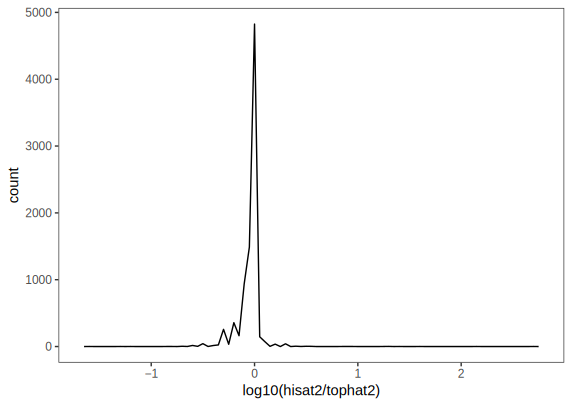

# Final Project
The goal of this project is to compare the alignment results of [HISAT2](https://ccb.jhu.edu/software/hisat2/index.shtml) and [TopHat2](https://ccb.jhu.edu/software/tophat/index.shtml). A subset of samples were obtained from `Bioinformatics_Course/RNAseq/RNAseq384plex_flowcell01/Project_plex1/Sample_1`. And the reference genome and the `.gtf` files were also from the course material.

The initial directory tree is like this:

```
.
|-- bam
|   |-- hisat2
|   `-- tophat2
|-- count
|-- log
|-- qc
|-- raw
|   |-- r1.fasta.gz
|   `-- r2.fasta.gz
`-- ref
    |-- dmel-all-chromosome-r6.13.fasta
 	`-- dmel-all-r6.13.gtf
```

The environment was setup with this conda [recipe](ee283.yml).


## Procedure
The results of `fastqc` look good: [r1.fasta_fastqc.html](r1.fasta_fastqc.html), [r2.fasta_fastqc.html](r2.fasta_fastqc.html).

```
$ fastqc -o qc/ -t 16 raw/*.fasta.gz > log/fastqc.log 2>&1
```

The index was built for TopHat2

```
ref $ bowtie2-build dmel-all-chromosome-r6.13.fasta bowtie2 > ../log/bowtie2-build.log 2>&1
```

and HISAT2

```
ref $ hisat2-build -p 16 dmel-all-chromosome-r6.13.fasta hisat2 > ../log/hisat2-build.log 2>&1
```

The alignment by TopHat2

```
$ tophat2 -p 16 -o bam/tophat2 ref/bowtie2 raw/r1.fasta.gz raw/r2.fasta.gz > log/tophat2.log 2>&1
```

and HISAT2

```
$ hisat2 -p 16 -x ref/hisat2 -1 raw/r1.fasta.gz -2 raw/r2.fasta.gz 2> log/hisat2.log | samtools view -bS > bam/hisat2/hisat2.bam
```

Since we are comparing alignment from the same samples, there’s no need to calculate RPKM. The reads counts are used directly. For this purpose, `htseq-count` from [HTSeq](https://htseq.readthedocs.io/en/release_0.11.1/) was used.

Before counting, the bam files need to be sorted by name.

```
tophat2 $ samtools sort -n accepted_hits.bam -o accepted_hits_sorted.bam
hisat2 $ samtools sort -n hisat2.bam -o hisat2_sorted.bam
```

And then the reads were counted.

```
$ htseq-count -f bam bam/tophat2/accepted_hits_sorted.bam ref/dmel-all-r6.13.gtf 2> log/htseq-count_hisat2.log > count/tophat2.tsv
$ htseq-count -f bam bam/hisat2/hisat2_sorted.bam ref/dmel-all-r6.13.gtf 2> log/htseq-count_hisat2.log > count/hisat2.tsv
```

And the counts were analyzed in R.


## Results

`bowtie2-build` (for TopHat2 alignment) took much longer time than `hisat2-build`.

`tophat2` also took longer time than `hisat2`. And the summary for TopHat2 reads

```
Left reads:
          Input     :   1750325
           Mapped   :   1638641 (93.6% of input)
            of these:   1261776 (77.0%) have multiple alignments (771683 have >20)
Right reads:
          Input     :   1750325
           Mapped   :   1625928 (92.9% of input)
            of these:   1252138 (77.0%) have multiple alignments (771678 have >20)
93.3% overall read mapping rate.

Aligned pairs:   1543968
     of these:   1189444 (77.0%) have multiple alignments
                  429310 (27.8%) are discordant alignments
63.7% concordant pair alignment rate.
```

And the summary for HISAT2

```
1750325 reads; of these:
  1750325 (100.00%) were paired; of these:
    236886 (13.53%) aligned concordantly 0 times
    358020 (20.45%) aligned concordantly exactly 1 time
    1155419 (66.01%) aligned concordantly >1 times
    ----
    236886 pairs aligned concordantly 0 times; of these:
      17901 (7.56%) aligned discordantly 1 time
    ----
    218985 pairs aligned 0 times concordantly or discordantly; of these:
      437970 mates make up the pairs; of these:
        200458 (45.77%) aligned 0 times
        47375 (10.82%) aligned exactly 1 time
        190137 (43.41%) aligned >1 times
94.27% overall alignment rate
```

`htseq-count` took much longer time for TopHat2 bam file, which had at least 1700000 entries. And the counting summary

```
__no_feature	196095
__ambiguous	39762
__too_low_aQual	0
__not_aligned	0
__alignment_not_unique	1324470
```

And HISAT2 bam file had less (6489785 entries). And the counting summary

```
__no_feature	180298
__ambiguous	32568
__too_low_aQual	74890
__not_aligned	39662
__alignment_not_unique	1258349
```

The rows containing 0 counts for both methods were removed from the counting results. And a log10 ratio of “hisat2/tophat2” was plotted in frequency.

```
ggplot(data = ht_ratio) + geom_freqpoly(mapping = aes(x = log10(hisat2/tophat2)), binwidth=.05) + theme_bw() + theme(panel.grid = element_blank())
```



This shows that the two methods have different results, but they have close “means”.

The raw processed data can be found at [ht_ratio.csv](ht_ratio.csv).